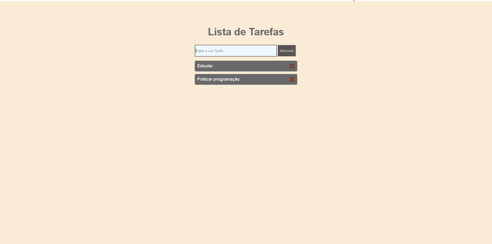

# <h1 aling="center">✅ To-Do List </h1>

<p align="center">
  
</p>

---

## 🚀 Funcionalidades

- Adicionar novas tarefas
- Remover tarefas individualmente
- Interface simples e intuitiva
- Totalmente responsiva

---

## 🛠 Tecnologias Utilizadas

- **HTML5** → Estrutura da aplicação  
- **CSS3** → Estilização da interface  
- **JavaScript** → Funcionalidade de adicionar/remover tarefas  

---

## 📌 Como Executar o Projeto

1. Baixe ou clone este repositório:
```bash
git clone https://github.com/aiwassHo/To-do-list.git